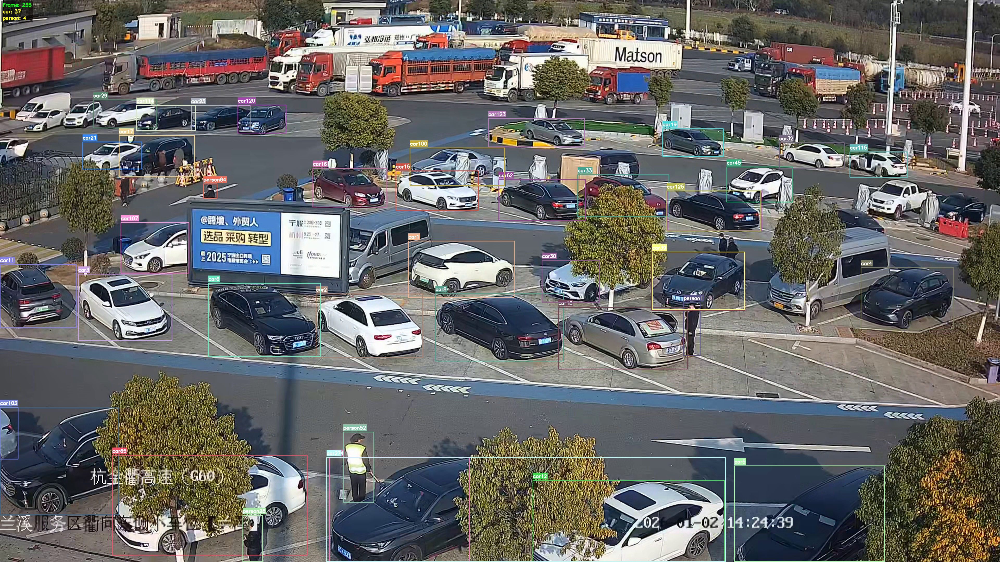
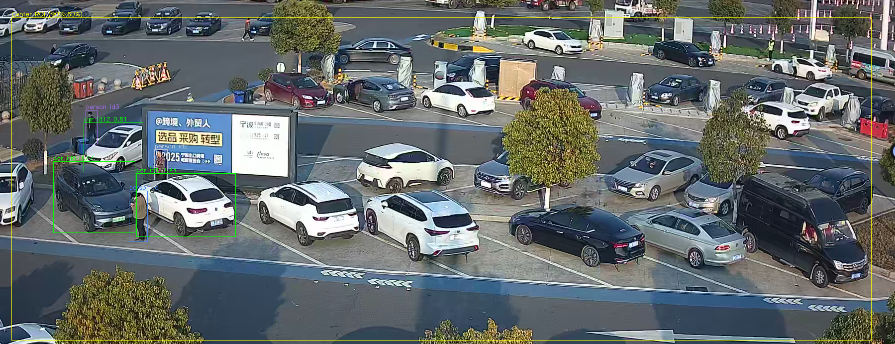

## Pedestrian & Car检测

### 一. 目的：

以YOLOv26的检测模型为引擎，检测视频中特定中心区域的行人和行人附近的车辆情况。后续需要实现部分抽样的车辆上下人的计数逻辑。

注意：本项目以体验Claude code的Vibe coding为主，全部代码为kimi - k2.5生成！！！

### 二. 已实现的功能：

- 对整个视频帧的中心区域设置为ROI，关注该区域的车辆和行人情况。

- detect_vehicle_v2.py： 

  1. 先去固定车辆ID，关注到的车和人进行标注和ID分配。标注的车辆需满足2个条件：

  （a）置信度为整个ROI区域检测车辆的Top 5；
  （b）检测的车辆附近必须有人，这里设置的是车辆与人之间的像素值不得大于100 pixel

  2. 以相邻帧行人的中心点+IoU+Cosine相似度三重判断来去重同一人物ID。

- detect_pedestrian.py ：个人觉得以行人为固定检测框（anchor），检测其附近车辆的情况效果更好。

  1. 以ROI内的行人为基准，检测实时帧的人物附近车辆；
  2. 同样以相邻帧行人的中心点+IoU+Cosine相似度三重判断来去重同一人物ID；
  3. 同时将检测出的行人进行同一检测ID的截图保存。

- resolution_remake.py 实现对视频的超分辨率重构，提升视频的分辨率来实现车辆和行人的清晰度提升功能。

- passenger_count.py 是基于detect_pedestrian.py的基础上，添加上下车逻辑和行人的ID判定方法：

  1. ROI内检测到的行人跟踪其轨迹来判定是否是同一个ID（只依赖于IoU+相邻帧该人物中心点距离）；

  2. 如果在ROI内行人消失时间超过8秒，则使用余弦相似度来判定；从ROI区域外进入ROI内也需余弦相似度计算。

  3. 上车判定方法：检测人与车中心点距离小于30 pixels且后续整个视频完全消失此ID才算上车；

  4. 下车判定方法：检测行人与车中心点距离小于15 pixels且前一帧该车辆未检测到人才计算下车；

  5. 输出：创建logs文件夹，保存统计数据于json文档中保存格式如下：

     ```python
     {
       "车辆ID13": {
         "上车行人": [
           2,
           5
         ],
         "下车行人": []
       }
     ```

### 三. 模型准备：

参考的相关模型包括：YOLOv26负责视频中行人+车辆的检测；由于视频普遍分辨率较低，需要AI进行视频超分辨率重构。

1. YOLOv26：[Ultralytics YOLO26 | Ultralytics Docs](https://docs.ultralytics.com/models/yolo26)；可以在这里下载YOLO26n，YOLO26s，YOLO26x等模型。**需要你自己创建个checkpoints文件夹进行保存。**
   使用模型需要预先```pip install ultralytics```，后实例化模型即可调用。
2. realesrgan-ncnn-vulkan超分辨率模型：[xinntao/Real-ESRGAN-ncnn-vulkan: NCNN implementation of Real-ESRGAN. Real-ESRGAN aims at developing Practical Algorithms for General Image Restoration.](https://github.com/xinntao/Real-ESRGAN-ncnn-vulkan)；也可以直接下载realesrgan的exe文件进行调用（个人选择这种）。
3. 检测结果：

- 任何模型未经过微调，直接调用YOLO26x的结果如下：



- 加入ROI和相邻视频帧行人去重判定条件结果：



### 四. 当前版本相关参数与模型问题

- detect_pedestrian.py 中的当前参数：

  ```markdown
  1. 行人检测置信度阈值: 0.25
  2. 车辆检测置信度阈值: 0.3
  3. 车人距离阈值(单位像素): 100  
  4. 中心检测区域宽度占画面比例: 0.9
  5. 中心检测区域高度占画面比例: 0.6
  6. 行人跟踪距离阈值: 100  --> IOU匹配失败后，距离较近的目标会被认为是同一个人，用于行人移动较快现象。
  7. 行人最大丢失帧数: 20
  8. IOU匹配阈值: 0.15  --> 相邻视频帧行人检测框的IoU阈值
  9. 余弦相似度阈值: 0.75  --> 检测到的人ID的余弦相似度
  10. 重识别历史帧数: 40
  ```

- passenger_count.py 中的当前参数：

  ```markdown
  1. 行人检测置信度阈值: 0.25
  2. 车辆检测置信度阈值: 0.25
  3. 最少存在帧数，低于此值的行人不统计上下车: 3
  4. 严格上车距离阈值，只有行人与车中心点距离小于此值且消失才算上车，单位像素: 30
  5. 严格下车距离阈值，只有行人与车中心点距离小于此值且前一帧车辆无人检测才计算下车，单位像素: 15
  6. 余弦相似度阈值: 0.7
  7. 使用重识别所需的消失秒数阈值，只有消失超过此时长或离开ROI才启用相似度匹配: 8
  ```

- 模型检测结果不足与问题：

1. 部分遮挡行人和距离较远的车辆会出现漏检情况。（漏检情况1）
2. 部分相邻帧的检测到行人（无遮挡）会出现漏检。（漏检情况2）
3. 部分木头桩和驾驶座位误识别成行人。（误判情况1）
4. 部分行人会被误归为同一ID。（相似度阈值调整）
